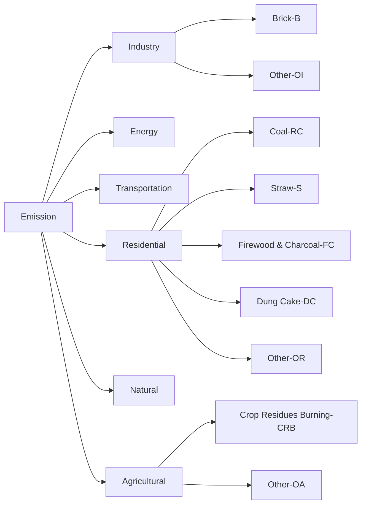

 

```mermaid
graph LR;
	A[Emission]
	A --> C[Industry]
	A --> B[Energy]
	A --> D[Transportation]
	A --> E[Residential]
	A --> N[Natural]
	A --> F[Agricultural]
	C --> G[Brick-B]
	C --> H[Other-OI]
	E --> I[Coal-RC]
	E --> J[Straw-S]
	E --> K[Firewood & Charcoal-FC]
	E --> L[Dung Cake-DC]
	E --> M[Other-OR]
	F --> O[Crop Residues Burning-CRB]
	F --> P[Other-OA]
```

